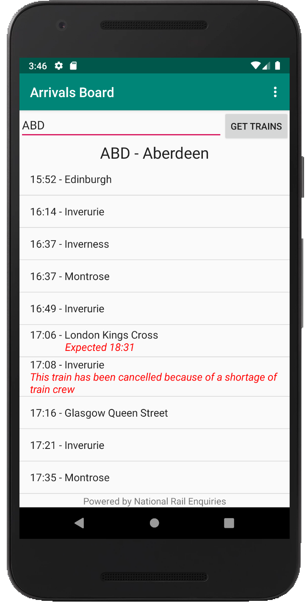
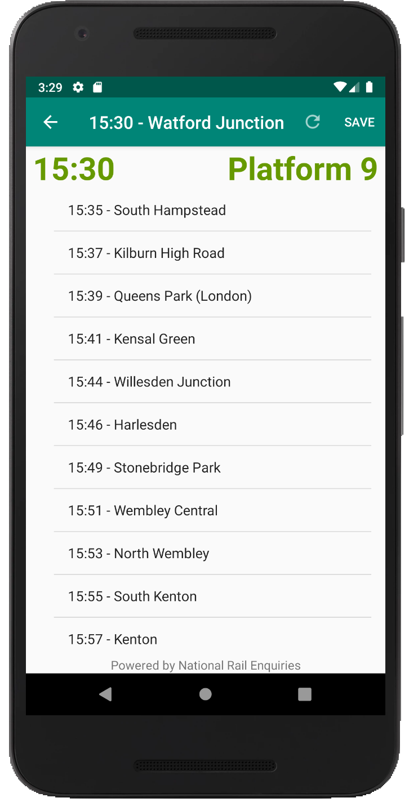
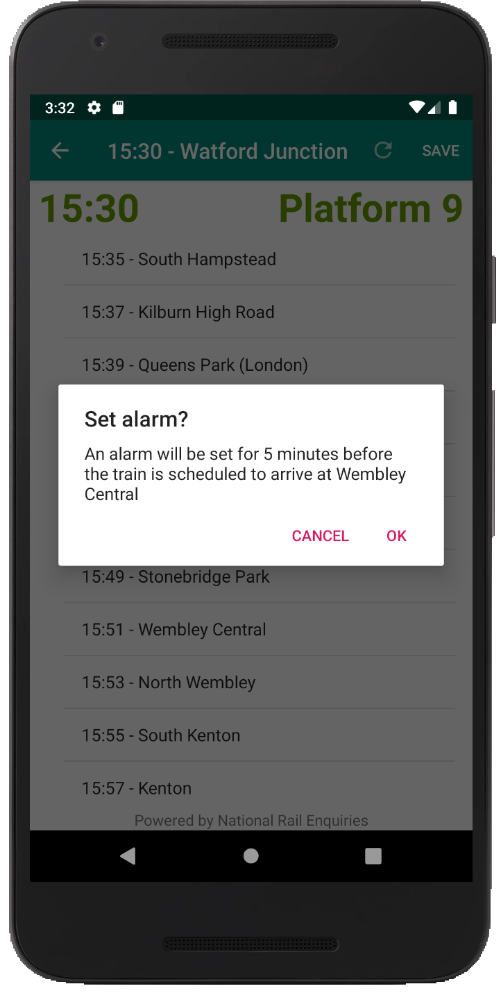
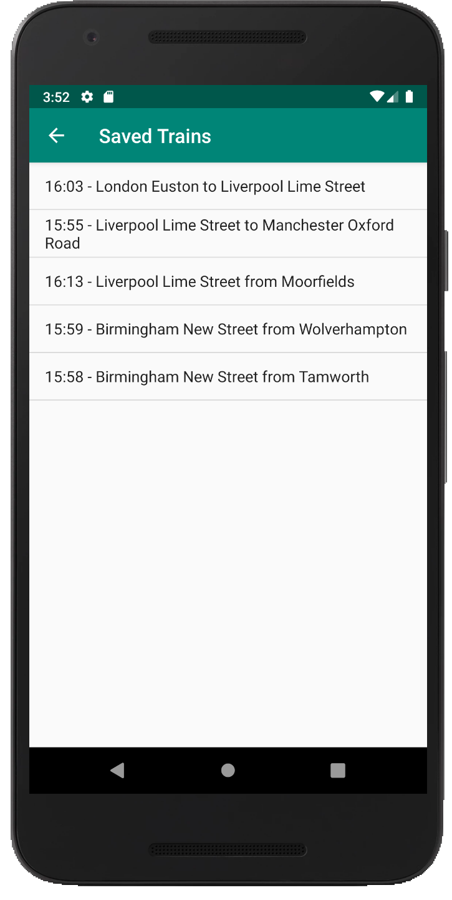
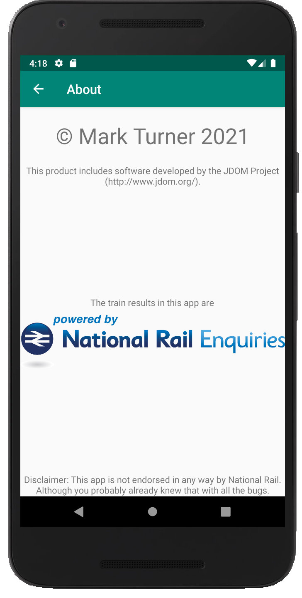

# TrainApp


A train timetable app for the UK which shows you arrivals / departure boards, allows you to save trains and track them later, and allows you to set alarms when you're close to your station. For Android only.

## Features

- View a departures / arrivals board for National Rail stations
- See reasons for trains being delayed (where avaliable)
- Save trains for you to track later
- Set alarms for when you're nearing your station
- Refresh only on-demand so it doesn't matter if you lose connection



## Usage

To use this app, simply import the root folder into Android Studio.
Then, change line 17 of [NetworkUtils.java](app/src/main/java/uk/markturner/apps/trainapp/NetworkUtils.java):

```java
private static final String token = "[INSERT YOUR TOKEN HERE WHICH YOU CAN GET FROM https://realtime.nationalrail.co.uk/OpenLDBWSRegistration/]";
```

Replace the whole String with your National Rail OpenLDBWS access token, which, as the placeholder suggests, you can obtain [here](https://realtime.nationalrail.co.uk/OpenLDBWSRegistration/).

Note that this app has been tested on Android Studio 4.2.1 on macOS 11.2.3, and an emulated Nexus 5X running Android 9.0 API 28. No guaruntees this will work on anything else. Or at all to be honest.

## Tech

TrainApp uses a number of projects, including:

- [JDOM](http://www.jdom.org/), the license for which can be found in the [JDOM .jar file](app/libs/jdom-2.0.6.jar)
- All rail results are [Powered by National Rail Enquiries](https://www.nationalrail.co.uk/) OpenLDBWS

## Known Issues

- The XML parsing is bad. Like really bad. I would be embarassed if I wasn't so tired after wrestling with the SOAP API
- Probably as a result of the above, sometimes the output in the train view is malformed. This app is very much in alpha
- Refresh doesn't do anything for Arrival trains
- I'm very new to Android development, so I've no idea of the best practices and efficiencies
- Perhaps someone more creative than me can think of a better name

I'd like to fix the above before I even think about additional features.


